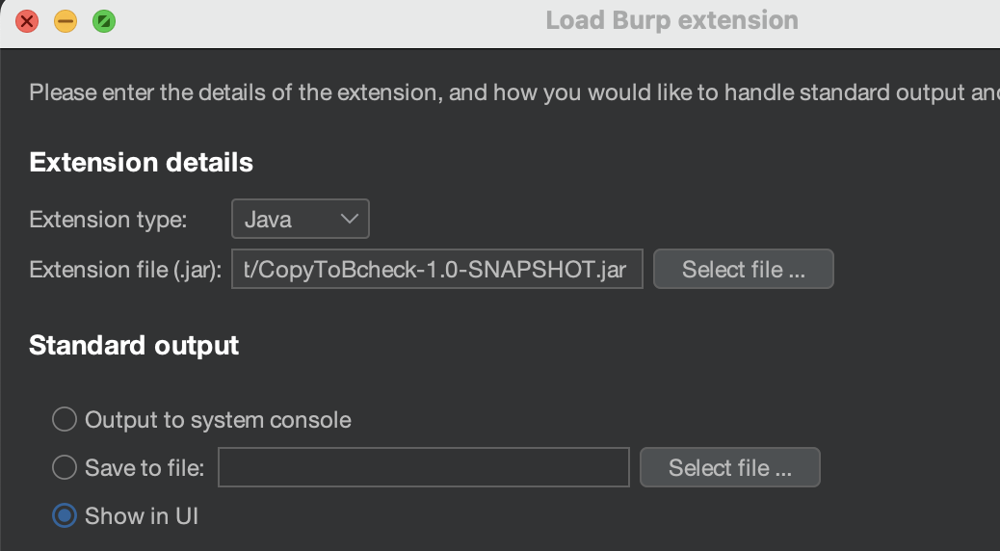
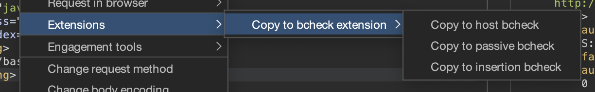
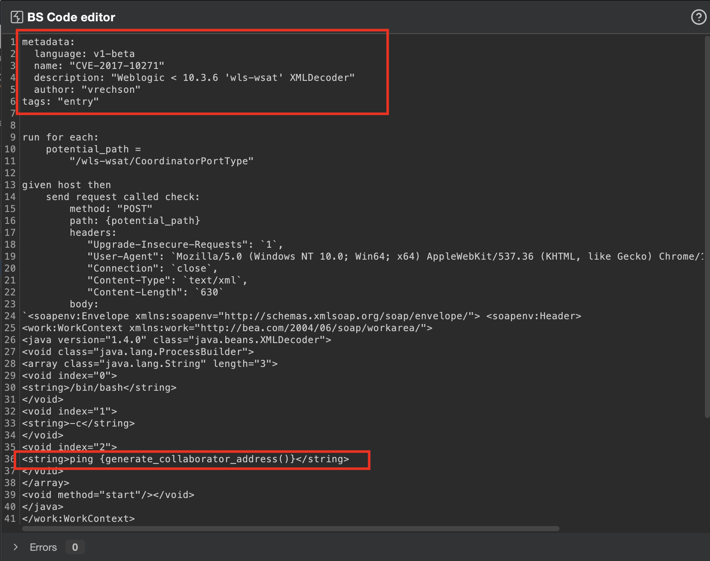
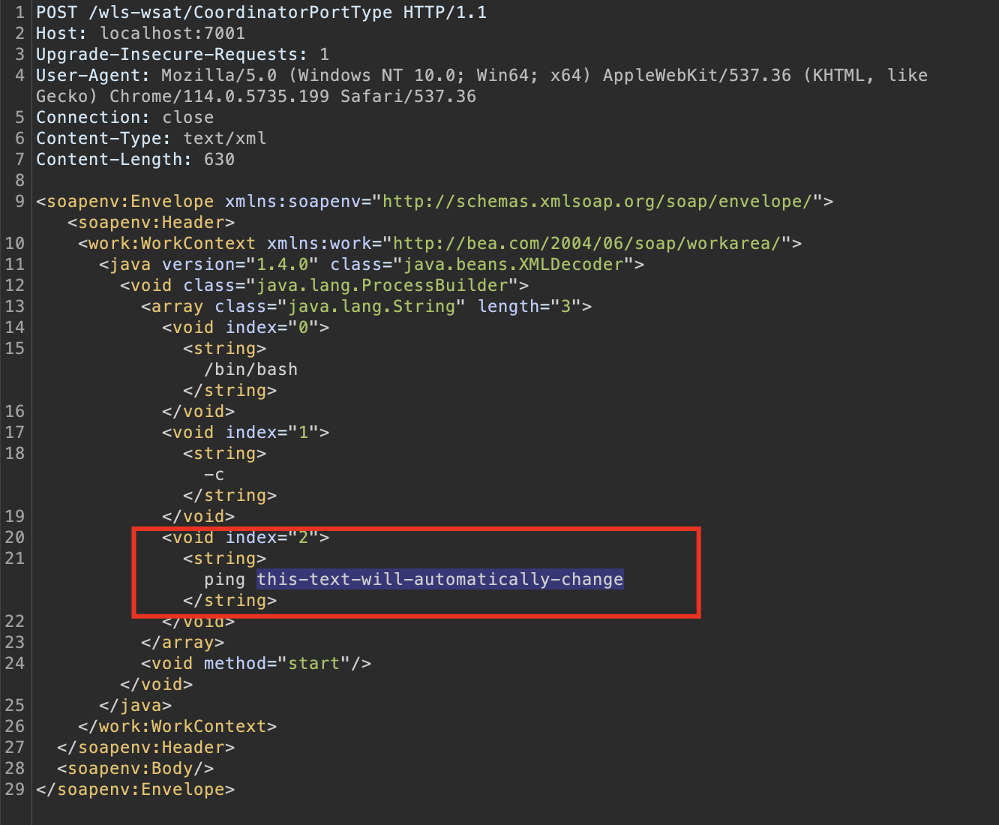

# Copy to Bcheck

The purpose of this extension is to streamline the process of creating simple bcheck scripts, reducing the time required to generate them. It works in conjunction with the data provided by the pentester, allowing them to easily copy requests from the Repeater tool and automatically format them into a bcheck script.

Note that this extension will 

## Installation

To install this extension, follow these steps:

1. Download the ``.jar`` file from the releases section of the extension's repository.
2. Open Burp Suite and navigate to the "Extensions" tab.
3. Click on the "Add" button in the "Installed" section.
In the dialog that appears, click on the "Choose file" or "Select file" button.
4. Browse to the location where you saved the downloaded ``.jar`` file and select it.
5. Click on "Next" to proceed with the installation.
6. If no errors occured, the extension will be working.
   

Click in next and check if there is no errors on the output.

## Usage

This extension offers support for creating three different types of bcheck scripts. Regardless of the specific script you want to generate, the process is simple and can be done by following these steps:

1. Open Burp Suite and navigate to the "Repeater" tool.
2. Right-click on the desired request or response within the Repeater tool.
3. From the context menu that appears, select the option related to the extension.
4. In the extension's context menu, choose the specific bcheck script you want to generate.

Below you can understand better each kind of script:

### Host-level bcheck scripts
The host bcheck script provided by this extension is designed to run once for each scanned host. It is based on the PortSwigger base host script and allows users to make specific changes according to their requirements.

Once you have right-clicked on a request or response and selected the "Copy to host bcheck" option from the extension's context menu, a new window will appear. In this window, you can provide additional details to customize the generated bcheck script according to your requirements. The window might look like this:

After providing the necessary information, click the "OK" button. The extension will then copy the generated bcheck script to your clipboard, ready to be pasted in the bcheck creation menu or any text editor of your choice:

An important time-saving feature of the extension is the ability to automatically import selected text from the request or response into the ``Value`` input field when using the ``Copy to host bcheck`` option.

If you have selected a specific piece of text within the request or response, such as a parameter value or a particular header, the extension will detect it and automatically populate the ``Value`` input field in the additional details window with the selected text. 

The folder examples/request also includes the request used in the screenshot for validation purposes.

### Passive bcheck scripts
The functionality of automatically generating a template based on selected strings or regex patterns in the request is similar to the passive base script provided by Portswigger. By simply selecting a specific string or regular expression within the request, you can swiftly generate a customized template that facilitates the detection of patterns within requests or responses.

### Insertion point-level bcheck scripts
When utilizing this option, any selected text will be transformed into a check that is applied to each insertion point encountered during scan requests. This means that the selected text will be used as a specific condition or vulnerability indicator that is checked at every point where user input is inserted into the request.

## Bcheck scripts documentation
To have a better knowledge about how to modify and improve the bcheck copied, follow the official PortSwigger's definition reference: https://portswigger.net/burp/documentation/scanner/bchecks/bcheck-definition-reference

## Contributions
Liked this extension and want to contribute? You canopenning issues to report bugs, submit pull requests with new features or buying a coffee for me.

.